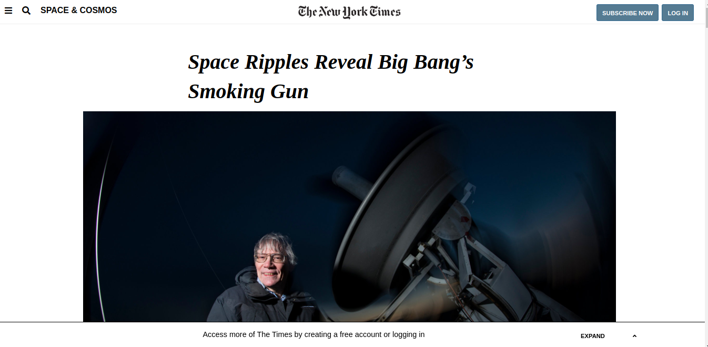

# New York Times Clone

> A clone of a New York Times article page.

In this project, we have created a replica of an article from the New York Times (https://www.nytimes.com/2014/03/18/science/space/detection-of-waves-in-space-buttresses-landmark-theory-of-big-bang.html?_r=0). We used flexbox, float and grid for positioning and layout.

## Built With

- HTML,
- CSS,
- Font awesome

## Live Demo

[Live Demo Link](https://meronokbay.github.io/nyt-clone/)

## Authors

👤 **Jorge Torres**

- Github: [@Yors-git](https://github.com/Yors-git)
- Twitter: [@Yors_82](https://twitter.com/Yors_82)

👤 **Meron Ogbai**

- Github: [@meronokbay](https://github.com/meronokbay)
- Twitter: [@MeronDev](https://twitter.com/MeronDev)
- Linkedin: [linkedin](https://linkedin.com/in/meron-ogbai-467414198/)

## 🤝 Contributing

Contributions, issues and feature requests are welcome!

Feel free to check the [issues page](https://github.com/meronokbay/nyt-clone/issues).

## Show your support

Give a ⭐️ if you like this project!
